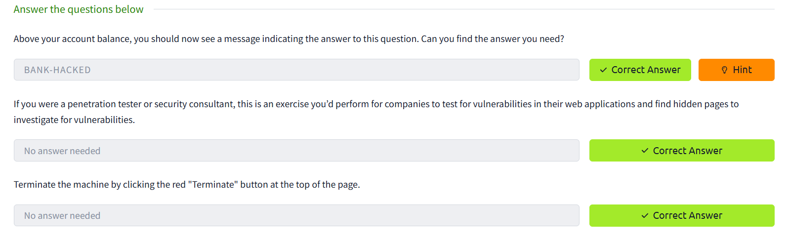

# 0x01 Introduction to Cyber Security

## Task 1 What is Offensive Security?

"To outsmart a hacker, you need to think like one."

This is the core of "Offensive Security." It involves breaking into computer systems, exploiting software bugs, and finding loopholes in applications to gain unauthorized access. The goal is to understand hacker tactics and enhance our system defences.

Beginning Your Learning Journey

In this TryHackMe room, you will be guided through hacking your first website in a legal and safe environment. The goal is to show you how an ethical hacker operates.

But before we do that, let's review by answering the questions below. Type your answer in the text box after the question and click the "Submit" button. When you're done, proceed to Task 2.

<figure><figcaption></figcaption></figure>

## Task 2 Hacking your first machine

Here at TryHackMe, we use Virtual Machines to create simulated environments that serve as practical complements to rooms.&#x20;

In this room, we have prepared a fake bank application called Fakebank that you can safely hack. To start this machine, click on the **Start Machine** button below.

Your screen should be split in half, showing this content on the left and the newly launched machine on the right. If you hide it later, you can always click on the **Show Split View** button at the top to display it again. You should see a browser window showing the website below:

<figure><figcaption></figcaption></figure>

If you don't see the one shown above, use the "Show Split View" button at the top of this page.

<figure><figcaption></figcaption></figure>

### Your First Hack

We will use a command-line application called "[Gobuster](https://github.com/OJ/gobuster)" to brute-force FakeBank's website to find hidden directories and pages. Gobuster will take a list of potential page or directory names and try accessing a website with each of them; if the page exists, it tells you.\


#### Step 1. Open A Terminal

A terminal, also known as the command line, allows us to interact with a computer without using a graphical user interface. On the machine, open the terminal by clicking on the Terminal icon on the right of the screen.\


<figure><figcaption></figcaption></figure>

#### Step 2. Use Gobuster To Find Hidden Website Pages

Most companies have an admin portal page, giving their staff access to basic admin controls for day-to-day operations. For a bank, an employee might need to transfer money to and from client accounts. Due to human error or negligence, there may be instances when these pages are not made private, allowing attackers to find hidden pages that show or give access to admin controls or sensitive data.

To begin, type the following command into the terminal to find potentially hidden pages on FakeBank's website using Gobuster (a command-line security application).

```bash
gobuster -u http://fakebank.thm -w wordlist.txt dir
```

The command will run and show you an output similar to this:

Gobustercommand to brute-force website pages

```markup
ubuntu@tryhackme:~/Desktop$ gobuster -u http://fakebank.thm -w wordlist.txt dir

=====================================================
Gobuster v2.0.1              OJ Reeves (@TheColonial)
=====================================================
[+] Mode         : dir
[+] Url/Domain   : http://fakebank.thm/
[+] Threads      : 10
[+] Wordlist     : wordlist.txt
[+] Status codes : 200,204,301,302,307,403
[+] Timeout      : 10s
=====================================================
2024/05/21 10:04:38 Starting gobuster
=====================================================
/images (Status: 301)
/bank-transfer (Status: 200)
=====================================================
2024/05/21 10:04:44 Finished
=====================================================
```

In the command above, `-u` is used to state the website we're scanning, `-w` takes a list of words to iterate through to find hidden pages.\


You will see that Gobuster scans the website with each word in the list, finding pages that exist on the site. Gobuster will have told you the pages in the list of page/directory names (indicated by Status: 200).

<figure><figcaption></figcaption></figure>

#### Step 3. Hack The Bank

You should have found a secret bank transfer page that allows you to transfer money between bank accounts (`/bank-transfer`). Type the hidden page into the FakeBank website using the browser's address bar.

<figure><figcaption></figcaption></figure>

From this page, an attacker has authorized access and can steal money from any bank account. As an ethical hacker, you would (with permission) find vulnerabilities in their application and report them to the bank to fix them before a hacker exploits them.

Your mission is to transfer $2000 from bank account 2276 to your account (account number 8881). If your transfer was successful, you should now be able to see your new balance reflected on your account page.

Go there now and confirm you got the money! (You may need to hit Refresh for the changes to appear)

<figure><figcaption></figcaption></figure>

## Task 3 Careers in cyber security

How can I start learning?

People often wonder how others become hackers (security consultants) or defenders (security analysts fighting cybercrime), and the answer is simple. Break it down, learn an area of cyber security you're interested in, and regularly practice using hands-on exercises. Build a habit of learning a little bit each day on TryHackMe, and you'll acquire the knowledge to get your first job in the industry.

Trust us; you can do it! Just take a look at some people who have used TryHackMe to get their first security job:

* Paul went from a construction worker to a security engineer. [Read more](https://tryhackme.com/r/resources/blog/construction-worker-to-security-engineer-how-paul-used-tryhackme-to-land-his-first-job-in-security)
* Kassandra went from a music teacher to a security professional. [Read more](https://tryhackme.com/r/resources/blog/the-teacher-becomes-the-student)
* Brandon used TryHackMe while at school to get his first job in cyber. [Read more](https://tryhackme.com/r/resources/blog/brandons-success-story)

What careers are there?

The cyber careers room goes into more depth about the different careers in cyber. However, here is a short description of a few offensive security roles:

* Penetration Tester - Responsible for testing technology products for finding exploitable security vulnerabilities.
* Red Teamer - Plays the role of an adversary, attacking an organization and providing feedback from an enemy's perspective.
* Security Engineer - Design, monitor, and maintain security controls, networks, and systems to help prevent cyberattacks.

